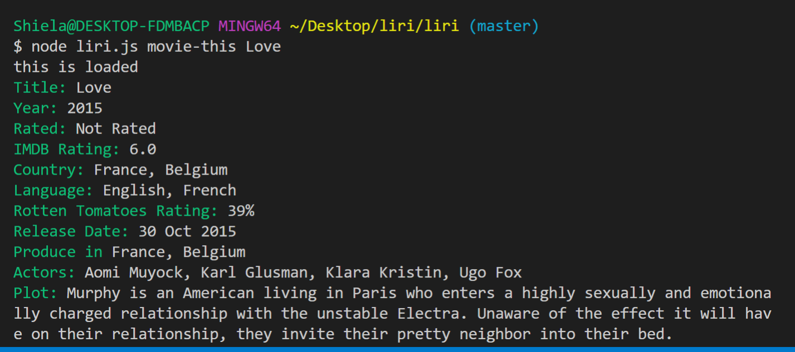
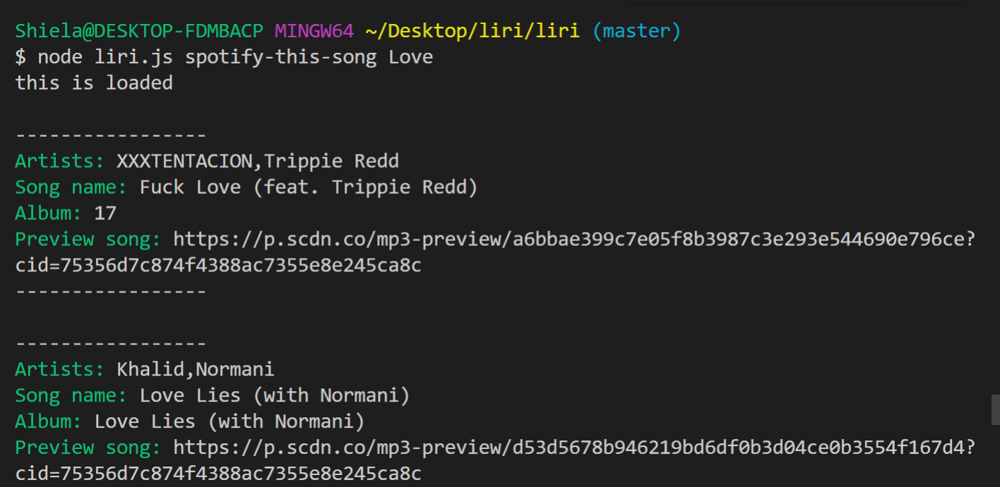

# Liri NodeJS
Liri NodeJS is a language interpretation and recognition interface. It is used in the command line and display to information about the movies, songs, event show... Liri NodeJS makes use of the OMDB API, the Spotify API, and the Twitter API. LiriJS was built with friendly user interaction in mind. for application includes a help command that and displays all important command information to the user.

## Getting Started
<i>The following is a getting started guide for how to know to run Liri.js on your machine.</i>

1. NodeJS - LiriJS is a node application and requiries node to be installed to run.
To install Node for your operating system.

2. Install Dependencies
nmp install init -y

3. Run LiriJS
    node Liri.js --version
and should print out the lastest build version of Liris, 
 
4. LiriJS was build with:
- NodeJS
- NPM
- Request npm module
- Node-spotify-api npm module
- Dot-env npm module

5. Command 
- <b>movie-this</b> [name value] - Returns movie information for provided name value
- <b>spotify-this-song</b> [name value] - Returns song information for provided name value
- <b>do-what-it-says</b> - Runs the command that is stored in random.txt
- <b>concert-this</b> [name value] - Returns shows concert information for provided name value

6. Import Keys
- Read and set environment variables
require("dotenv").config();

- Import the API keys
var keys = require("./keys");

- Import the node-spotify-api package.
var Spotify = require("node-spotify-api");

- Import the axios npm package.
var axios = require("axios");

- Import the moment npm package.
var moment = require("moment");

- Import the FS package for read/write.
var fs = require("fs");

## Preview

